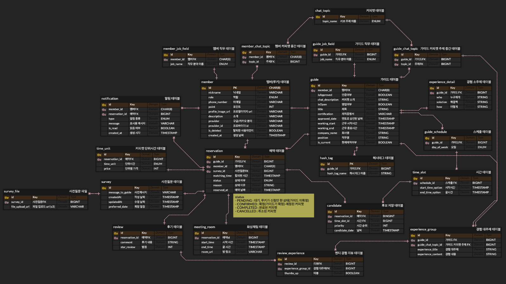

# [CREMA] 커피챗 플랫폼
<div align="center">
    <div>
        
    </div>
</div>


# 🚀 목차
- [📌 프로젝트 소개](#프로젝트-소개)
  - [개요](#개요)
  - [주요 기능](#주요-기능)
  - [멤버](#멤버)
  
- [🎨 화면 구성](#화면-구성)
  - [데모 영상](#데모-영상)
  - [스크린샷](#스크린샷)

- [🛠️ 기술 스택](#기술-스택)

- [💡 아키텍처](#아키텍처)

- [🗂️ ERD Diagram](#ERD-Diagram)

- [💥 Challenges & Troubleshooting](#challenges--troubleshooting)
  
- [🚦 시작 가이드](#시작-가이드)

- [🌐 문서 보기](#문서-목록)

---

<br><br><br>

# 프로젝트 소개
### "Cream는 취업 준비 과정에서 현직자와 구직자를 부담 없이 연결할 수 있는 1:1 커피챗 서비스"
## 개요
- ### 프로젝트 이름: Crema (크레마) - 커피챗 플랫폼
- ### 문제 정의
  - "주니어 멘토는 자신의 경험이 과연 누군가에게 도움이 될 만큼 가치 있는지에 대한 불안 때문에 참여를 주저"
  - "취업, 이직을 준비하는 사람들은 현직자의 경험과 맥락적 정보를 원함"
  - "장기 네트워킹, 오프라인 모임은 시간, 비용, 심리적 부담이 커서 참여 장벽이 높음"
- ### 프로젝트 목적
  - 주니어 멘토가 부담 없이 대화할 수 있도록, 크레마는 '멘토링'이 아닌 '커피챗'으로 포지셔닝
  - 화상, 음성, 채팅, 자료공유 등 자유롭게 이야기할 수 있는 환경 제공
  - 짧고 부담 없는 '1:1 온라인 커피챗 경험'을 통해 멘토, 멘티 모두의 진입 장벽을 낮춤
  - '예약, 화상채팅, 일정 관리' 기능을 통합하여 원스톱 커리어 네트워킹 서비스 구축
- ### 프로젝트 기간: 2025.08.11 ~ 2025.09.15 (35일)
  
  

## 주요 기능
- ### 로그인 / 회원가입 
  - OAuth2(Google, Kakao)를 통한 간편 로그인
- ### 예약 기능
  - 멘토/멘티 간 커피챗 일정 예약 및 관리
- ### 화상 채팅
  - OpenVidu 라이브러리를 활용한 실시간 1:1 화상 대화
- ### 실시간 알림
  - SSE(Server-Sent Events)를 통한 예약/채팅 알림 제공
- ### 마이페이지
  - 예약 내역, 진행 예정 커피챗, 알림 기록 확인
- ### 멘토/멘티 프로필
  - 멘토의 전문 분야, 경력, 관심사 공개 및 검색 가능
- ### 후기/피드백
  - 커피챗 종료 후 간단한 후기 작성 기능

<br><br><br>

## 멤버
<div align="center">
    <table style="width:100%; border:none;">
        <tr style="border:none;">
            <td align="center" style="border:none;">
                <a href="https://github.com/Coffee-Commit" target="_blank">
                    
                    <br />
                    <b>김민지</b>
                    <br />
                    <samp>Product Management</samp>
                </a>
            </td>
            <td align="center" style="border:none;">
                <a href="https://github.com/hyakki54" target="_blank">
                    
                    <br />
                    <b>김선민</b>
                    <br />
                    <samp>Product Designer</samp>
                </a>
            </td>
            <td align="center" style="border:none;">
                <a href="https://github.com/H0D0D0" target="_blank">
                    
                    <br />
                    <b>윤하정</b>
                    <br />
                    <samp>Product Designer</samp>
                </a>
            </td>
            <td align="center" style="border:none;">
                <a href="https://github.com/yg5057" target="_blank">
                    
                    <br />
                    <b>조연경</b>
                    <br />
                    <samp>FrontEnd</samp>
                </a>
            </td>
        </tr>
        <tr style="border:none;">
            <td align="center" style="border:none;">
                <a href="https://github.com/jam9582" target="_blank">
                    
                    <br />
                    <b>권재은</b>
                    <br />
                    <samp>BackEnd</samp>
                </a>
            </td>
            <td align="center" style="border:none;">
                <a href="https://github.com/Roysung0625" target="_blank">
                    
                    <br />
                    <b>성정현</b>
                    <br />
                    <samp>BackEnd</samp>
                </a>
            </td>
            <td align="center" style="border:none;">
                <a href="https://github.com/BDOR665" target="_blank">
                    
                    <br />
                    <b>장윤영</b>
                    <br />
                    <samp>BackEnd</samp>
                </a>
            </td>
            <td align="center" style="border:none;">
                <a href="https://github.com/csyhorizon" target="_blank">
                    
                    <br />
                    <b>최수용</b>
                    <br />
                    <samp>Infra & DevOps</samp>
                </a>
            </td>
        </tr>
    </table>
</div>

---

<br><br><br>

# 화면 구성
## 데모 영상
- 아직 없음
## 스크린샷
- 아직 없음
---

<br><br><br>

## 기술 스택
### 🖥️ FrontEnd


### 🔧 BackEnd


### 💾 Database


### Cloud Storage


### 🛠️ Development Tools


### ☁️ Infra


### 📈 Monitoring


### 💬 Communication & Design Tools


---

<br><br><br>

## 아키텍처


---

<br><br><br>

## ERD Diagram


- **회원/사용자 관련**
  - `멤버(루키) 테이블`: 멘토/멘티 계정 정보 저장
  - `멤버 직무 테이블`: 멤버별 관심 직무 정보
- **커피챗/예약 관련**
  - `예약 테이블`: 멘토와 멘티 간 커피챗 예약 내역
  - `스케줄 테이블` + `시간 테이블`: 멘토의 가능한 일정 관리
  - `커피챗 단위시간 테이블`: 시간 단위별 요금/예약 단위
  - `화상채팅 테이블`: 예약에 대한 화상 채팅 기록
- **가이드/주제 관련**
  - `가이드 테이블`: 멘토 가이드 정보
  - `가이드 직무 테이블`, `가이드 커피챗 주제 중간 테이블`: 가이드별 주제와 직무 매핑
  - `경험 대주제 테이블`, `경험 소주제 테이블`: 커피챗에서 다루는 경험 주제
- **커뮤니케이션/부가 기능**
  - `알림 테이블`: 예약/채팅 알림 기록
  - `사전질문 테이블`, `사전질문 파일`: 사전 질문과 첨부 파일 관리
  - `후기 테이블`, `멘티 경험 리뷰 테이블`: 커피챗 후기/피드백
- **태그/중간 테이블**
  - `해시태그 테이블`, `멤버 커피챗 중간 테이블`, `커피챗 테이블`: 주제/태그/연관 관계 관리

📄 [ERD 상세 문서 보기](docs/sql_schema.md)

---

<br><br><br>

## Challenges & Troubleshooting
- **프론트엔드**: 
- **백엔드**: 
- **인프라**: 

📄 [자세한 Troubleshooting 기록 보기](docs/troubleshooting.md)

---
<br><br><br>

## 시작 가이드
```
Local 환경에서 진행할 수 있는 방법을 작성합니다.
인프라 배포의 경우 전반적인 인프라 지식이 필요하여 문서에는 제외됩니다.

[사전 작업]
- 구성: Redis, MySQL, S3
- API: Google, Kakao Oauth
- 필수 설치 : Docker
```
---
### 1. 프로젝트 복제
> 현재 프로젝트의 'Crema_Frontend'와 'Crema_Backend'를 clone합니다.
---
### 2. FrontEnd
#### A. Docker Image 생성
- FrontEnd로 디렉터리 이동 후 다음 명령을 통해 Docker Image를 생성합니다.
    > docker build -t nextjs-app --build-arg NEXT_PUBLIC_API_URL=http://backend-service:8080 .

#### B. Docker Container 실행
- 다음 명령을 통해 컨테이너로 실행합니다.
    > docker run -p 3000:3000 nextjs-app

#### C. 실행 확인
- 정상적으로 구동되었는 지 'localhost:3000'으로 접속하여 확인합니다.
---
### 3. OpenVidu
#### A. 
---
### 4. Backend
#### A. 환경 변수 설정 및 생성 (.env)
- 환경 변수가 없으면 백엔드는 구동할 수 없습니다. 백엔드 디렉터리에 .env 생성 후 값을 포함합니다.
```
# AWS S3
AWS_S3_BUCKET={AWS_S3_BUCKET_NAME}
AWS_REGION={AWS_S3_REGION}
AWS_ACCESS_KEY={AWS_S3_ACCESS_KEY}
AWS_SECRET_KEY={AWS_S3_SECRET_KEY}

# 배포 환경
SPRING_PROFILES_ACTIVE=dev

# Redis
SPRING_DATA_REDIS_HOST=localhost
SPRING_DATA_REDIS_PORT='6379'

# FrontEnd Url
FRONTEND_URL=http://localhost:3000

# 쿠키 관련
COOKIE_DOMAIN=localhost
COOKIE_SAMESITE=None

# DB (MySQL)
DB_HOST={DB_HOST}
DB_PORT={DB_PORT}
DB_NAME={DB_NAME}
DB_USERNAME={DB_USERNAME}
DB_PASSWORD={DB_PASSWORD}

# Oauth2
GOOGLE_CLIENT_ID={OAUTH_GOOGLE_CLIENT_ID}
GOOGLE_CLIENT_SECRET={OAUTH_GOOGLE_CLIENT_SECRET}

KAKAO_CLIENT_ID={OAUTH_GOOGLE_CLIENT_ID}
KAKAO_CLIENT_SECRET={OAUTH_GOOGLE_CLIENT_SECRET}

# Jwt Key
JWT_KEY={JWT_KEY}
```

#### B. Docker Image 생성
- BackEnd로 디렉터리 이동 후 다음 명령을 통해 Docker Image를 생성합니다.
    > docker build -t spring-app .

#### C. Docker Container 실행
- 다음 명령을 통해 컨테이너로 실행합니다.
  > docker run -p 8080:8080 --env-file .env spring-app

---

<br><br><br>

## 문서 목록
📖 [API 문서 보기](https://coffee-commit.github.io/Crema_Infra/html/api-doc.html)