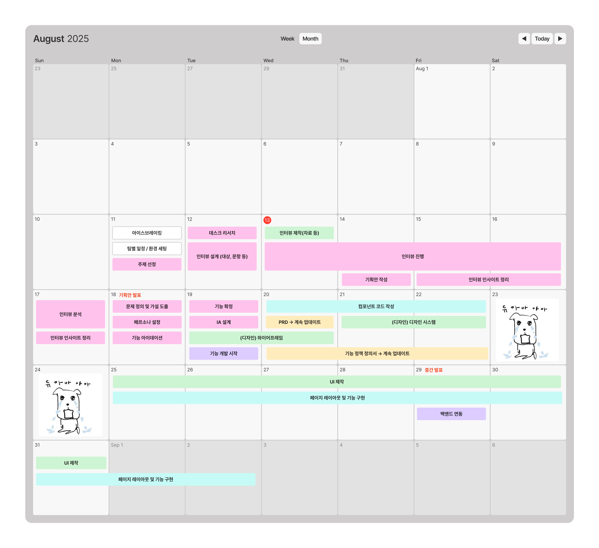
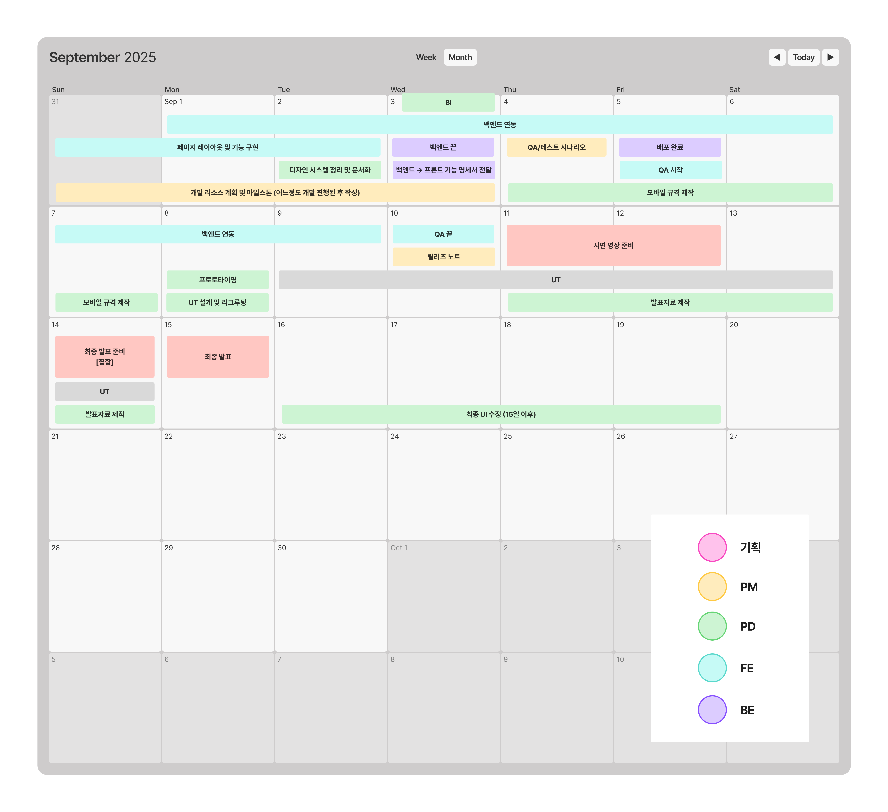
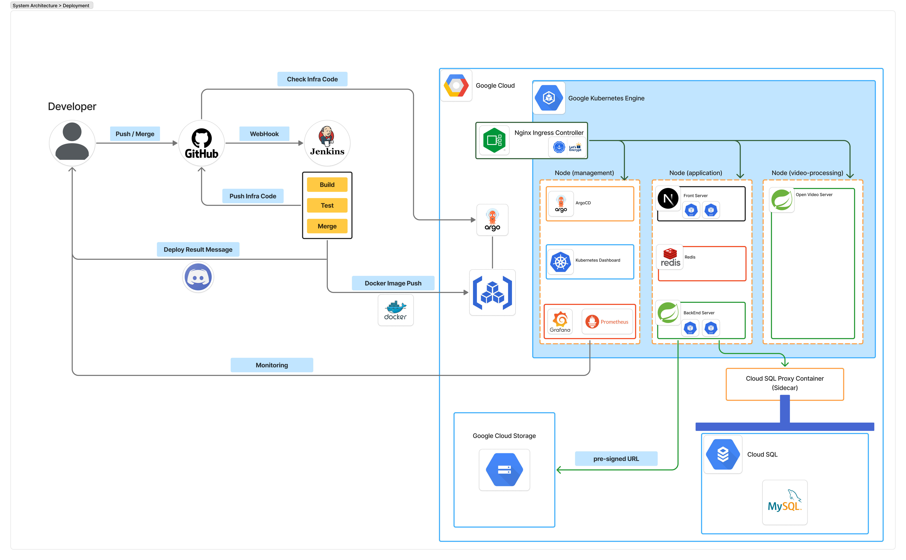

# [CREMA] 커피챗 플랫폼
<div align="center">
    <div>
        
    </div>
</div>


# 🚀 목차
- [프로젝트 소개](#프로젝트-소개)
  - [개요](#개요)
  - [주요 기능](#주요-기능)
  - [개발 기간 및 팀원](#개발-기간-및-팀원)
  
- [🎨 화면 구성](#화면-구성)
  - [데모 영상](#데모-영상)
  - [스크린샷](#스크린샷)

- [🛠️ 기술 스택](#기술-스택)

- [💡 아키텍처](#아키텍처)
  
- [🚦 시작 가이드](#시작-가이드)

- [🌐 API 문서 보기](#api-문서-보기)

---

# 프로젝트 소개
## 개요
- 프로젝트 이름: Crema (크레마) - 커피챗 플랫폼
- 프로젝트 목적 / 문제 정의
- 프로젝트 기간: 2025.08.11 ~ 2025.09.15 (35일)
  
  

## 주요 기능
- 주요 기능
## 개발 기간 및 팀원
- 개발 기간 및 팀원
---
# 화면 구성
## 데모 영상
- 데모 영상
## 스크린샷
- 스크린샷
---
## 기술 스택
- 기술 스택
---
## 아키텍처


---


## 시작 가이드
```
Local 환경에서 진행할 수 있는 방법을 작성합니다.
인프라 배포의 경우 전반적인 인프라 지식이 필요하여 문서에는 제외됩니다.

[사전 작업]
- 구성: Redis, MySQL, S3
- API: Google, Kakao Oauth
- 필수 설치 : Docker
```
---
### 1. 프로젝트 복제
> 현재 프로젝트의 'Crema_Frontend'와 'Crema_Backend'를 clone합니다.
---
### 2. FrontEnd
#### A. Docker Image 생성
- FrontEnd로 디렉터리 이동 후 다음 명령을 통해 Docker Image를 생성합니다.
    > docker build -t nextjs-app --build-arg NEXT_PUBLIC_API_URL=http://backend-service:8080 .

#### B. Docker Container 실행
- 다음 명령을 통해 컨테이너로 실행합니다.
    > docker run -p 3000:3000 nextjs-app

#### C. 실행 확인
- 정상적으로 구동되었는 지 'localhost:3000'으로 접속하여 확인합니다.
---
### 3. OpenVidu
#### A. 
---
### 4. Backend
#### A. 환경 변수 설정 및 생성 (.env)
- 환경 변수가 없으면 백엔드는 구동할 수 없습니다. 백엔드 디렉터리에 .env 생성 후 값을 포함합니다.
```
# AWS S3
AWS_S3_BUCKET={AWS_S3_BUCKET_NAME}
AWS_REGION={AWS_S3_REGION}
AWS_ACCESS_KEY={AWS_S3_ACCESS_KEY}
AWS_SECRET_KEY={AWS_S3_SECRET_KEY}

# 배포 환경
SPRING_PROFILES_ACTIVE=dev

# Redis
SPRING_DATA_REDIS_HOST=localhost
SPRING_DATA_REDIS_PORT='6379'

# FrontEnd Url
FRONTEND_URL=http://localhost:3000

# 쿠키 관련
COOKIE_DOMAIN=localhost
COOKIE_SAMESITE=None

# DB (MySQL)
DB_HOST={DB_HOST}
DB_PORT={DB_PORT}
DB_NAME={DB_NAME}
DB_USERNAME={DB_USERNAME}
DB_PASSWORD={DB_PASSWORD}

# Oauth2
GOOGLE_CLIENT_ID={OAUTH_GOOGLE_CLIENT_ID}
GOOGLE_CLIENT_SECRET={OAUTH_GOOGLE_CLIENT_SECRET}

KAKAO_CLIENT_ID={OAUTH_GOOGLE_CLIENT_ID}
KAKAO_CLIENT_SECRET={OAUTH_GOOGLE_CLIENT_SECRET}

# Jwt Key
JWT_KEY={JWT_KEY}

```

#### B. Docker Image 생성
- BackEnd로 디렉터리 이동 후 다음 명령을 통해 Docker Image를 생성합니다.
    > docker build -t spring-app .

#### C. Docker Container 실행
- 다음 명령을 통해 컨테이너로 실행합니다.
  > docker run -p 8080:8080 --env-file .env spring-app

---

## API 문서 보기
📖 [API 문서 보기](https://coffee-commit.github.io/Crema_Infra/html/api-doc.html)