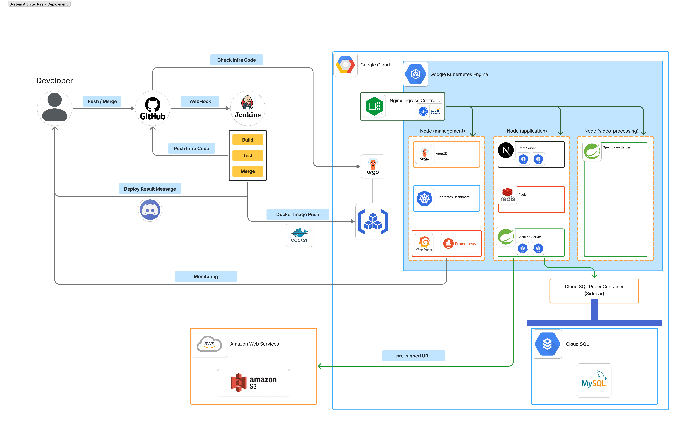

# [CREMA]

    

## 🚀 목차
- [개요](#개요)
- [프로젝트 소개](#ㄹㄹ)
- [설치 방법](#설치-방법)

## 개요
---
- 프로젝트 이름: 
- 프로젝트 기간: 2025.08.11 ~ 2025.09.15 (35일)
- 개발
- 멤버

프로젝트 기간 : 8/11 ~ 9/15

## 📜 개요 (Overview)

본 인프라는 [CREMA]을 [GCP] 환경에 배포하고 안정적으로 운영하는 것을 목표로 합니다.

- **Cloud Provider**: `GCP`
- **Orchestration**: `Kubernetes`
- **CI/CD**: `Jenkins` / `ArgoCD`

### 아키텍처 다이어그램

---

## 설치 방법